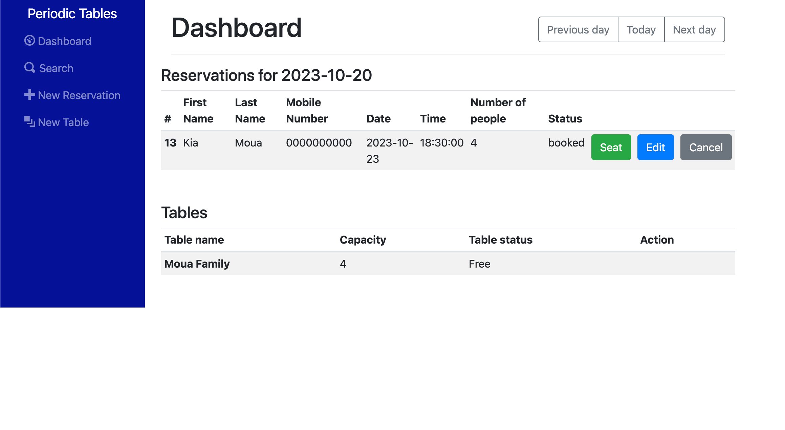
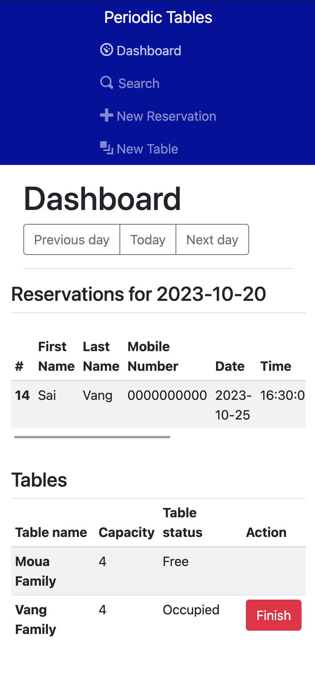
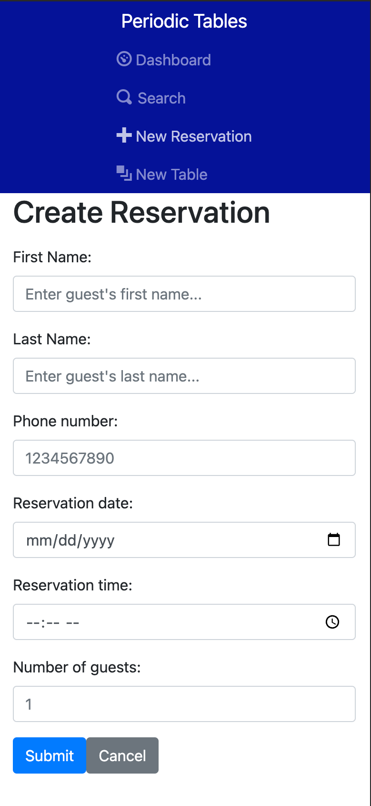
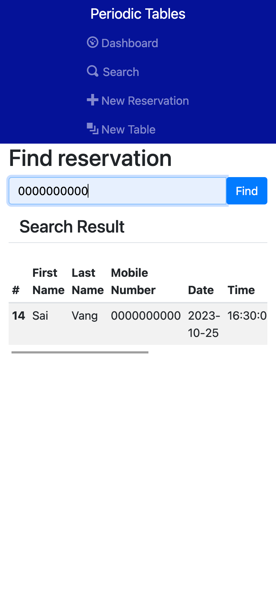

<h1 align="center">Welcome to starter-restaurant-reservation 👋</h1>
<p>
  
  <a href="https://github.com/Thinkful-Ed/starter-restaurant-reservation#readme" target="_blank">
    
  </a>
  <a href="https://github.com/Thinkful-Ed/starter-restaurant-reservation/graphs/commit-activity" target="_blank">
    
  </a>
  <a href="https://github.com/Thinkful-Ed/starter-restaurant-reservation/blob/master/LICENSE" target="_blank">
    
  </a>
</p>

> Starter project restaurant reservation system

### ✨ [Demo](https://restaurant-reservation-front-end-njh9.onrender.com)








## Install

```sh
npm install
```

## Usage

```sh
npm run start
```

## Run tests

```sh
npm run test
```

## Author

👤 **Thinkful, Inc.**

* Github: [@mouakiang](https://github.com/mouakiang)
* LinkedIn: [@https:\/\/www.linkedin.com\/in\/kiangmoua\/](https://linkedin.com/in/https:\/\/www.linkedin.com\/in\/kiangmoua\/)

## Show your support

Give a ⭐️ if this project helped you!

## 📝 License

Copyright © 2023 [Thinkful, Inc.](https://github.com/mouakiang).<br />
This project is [UNLICENSED](https://github.com/Thinkful-Ed/starter-restaurant-reservation/blob/master/LICENSE) licensed.

